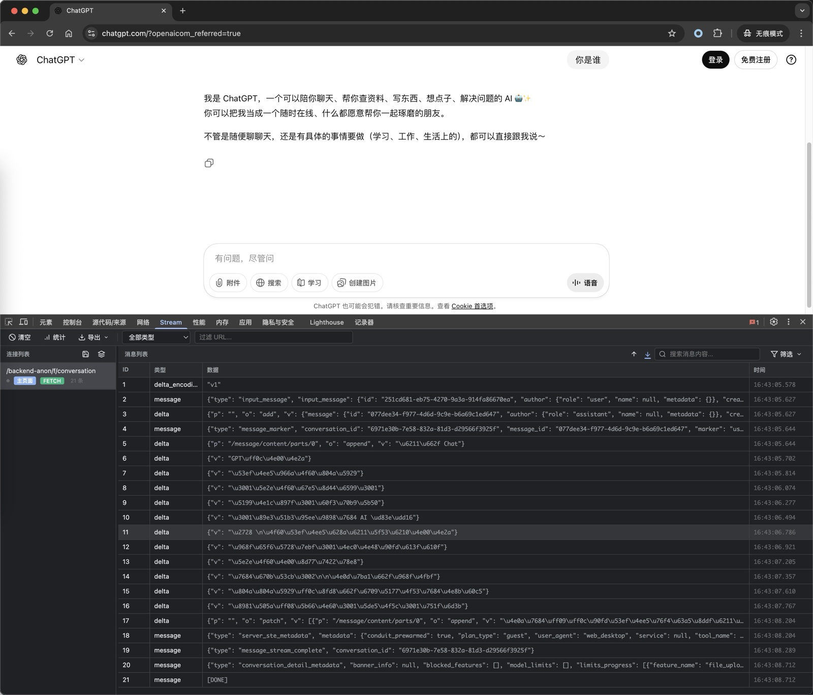
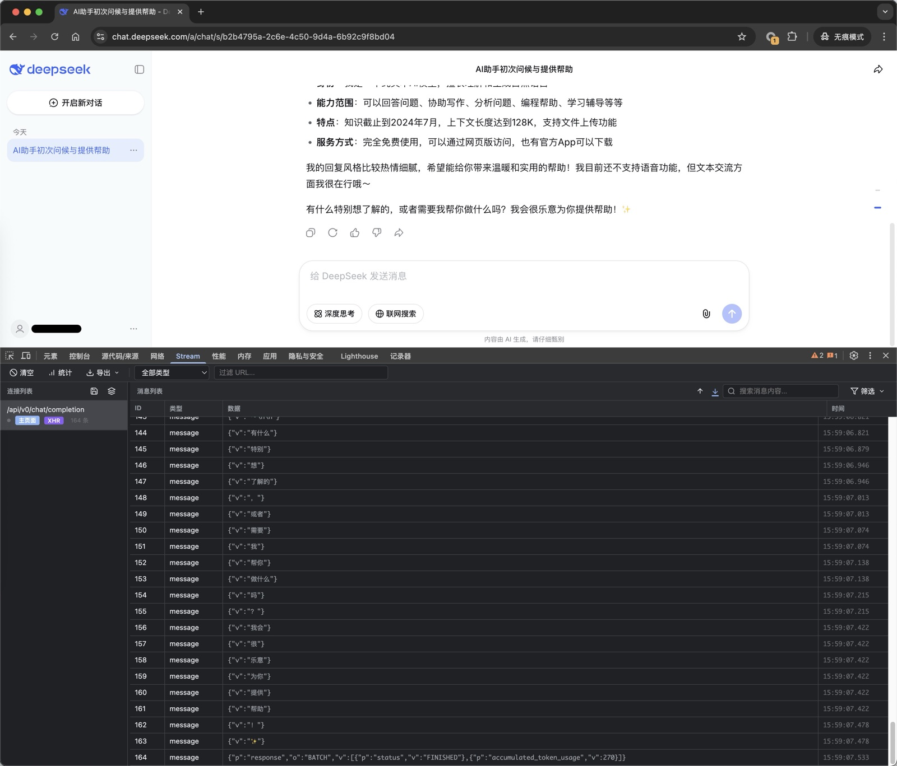
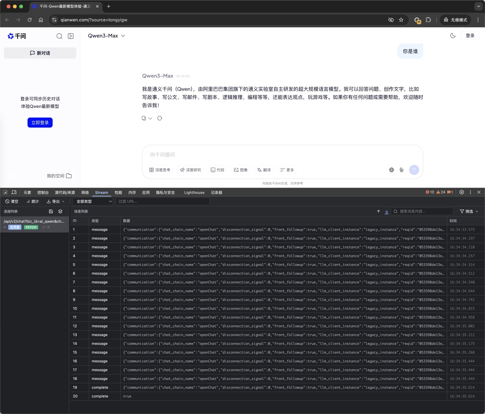
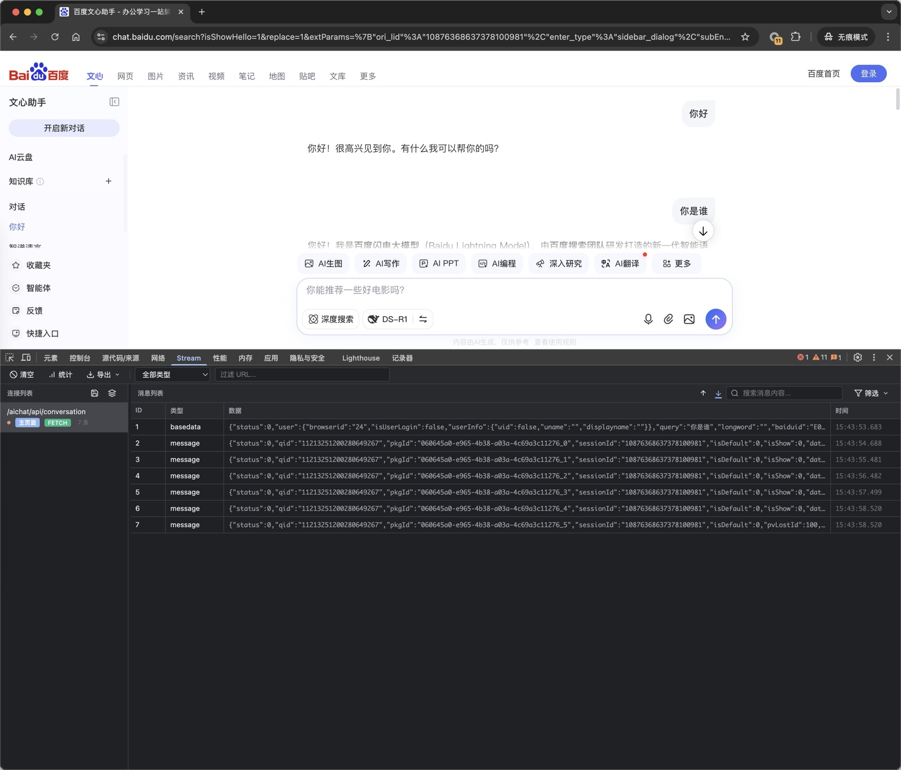
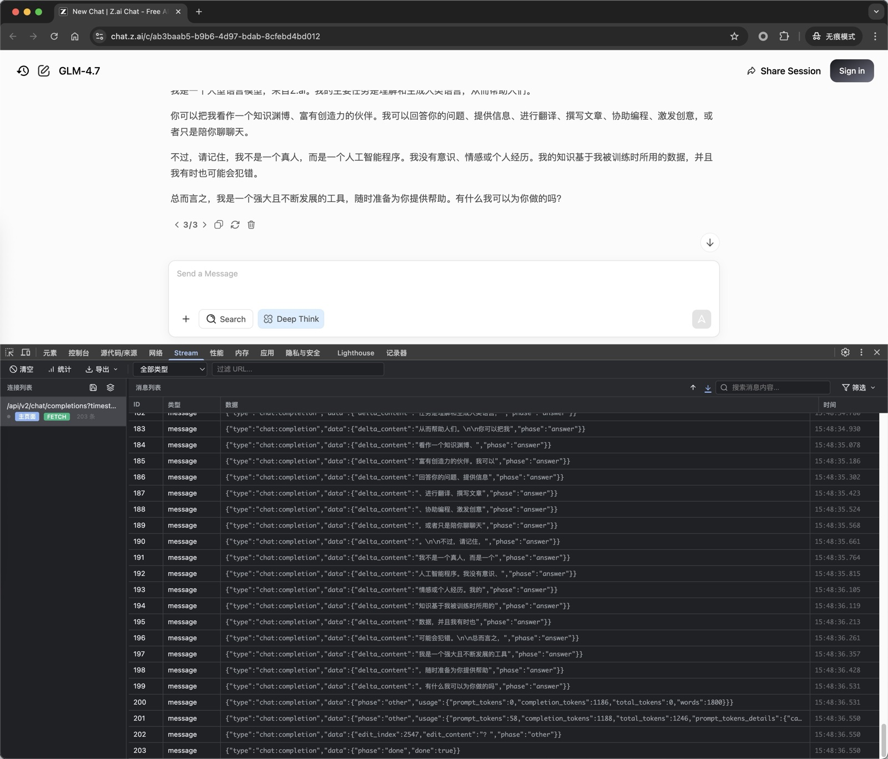

# 🌊 Stream Panel - Chrome DevTools Extension for SSE & Fetch Stream Monitoring

[](LICENSE)
[](https://github.com/bywwcnll/SreamPanel/stargazers)

[English](#english) | [中文](#中文)

---

## English

### Overview

**Stream Panel** is a Chrome DevTools extension that allows developers to monitor and inspect streaming requests in real-time. It supports both **Server-Sent Events (SSE)** and **Fetch-based Stream** connections, making it an essential tool for debugging streaming APIs and viewing real-time data pushes.

### Why Stream Panel?

- 🔥 **Most Feature-Rich SSE Monitor**: Unlike basic SSE viewers, Stream Panel offers comprehensive filtering, search, and export capabilities
- ⚡ **Multiple Stream Types**: Supports EventSource, Fetch Stream, and XMLHttpRequest - all in one tool
- 🎯 **Real-Time Debugging**: Monitor live data streams without leaving Chrome DevTools
- 💾 **Data Persistence**: Save and restore connection data for later analysis
- 📊 **Advanced Analytics**: Track connection statistics and message counts
- 🔍 **Powerful Search**: Full-text search across all messages with highlighting
- 📤 **Flexible Export**: Export data in JSON or CSV format (Excel-compatible)

**Perfect for:**
- ✅ Debugging AI chat application streaming responses
- ✅ Testing server-sent events and push notifications
- ✅ Monitoring real-time APIs and WebSocket alternatives
- ✅ Analyzing streaming data patterns
- ✅ Quality assurance testing for streaming features

### Screenshots

Monitor streaming responses from popular AI chat applications:

#### ChatGPT


#### DeepSeek


#### Doubao


#### Qwen


#### Wenxin


#### Zhipu


*Stream Panel works seamlessly with all major AI chat platforms*

### Features

 - 🔍 **Real-time Monitoring**: Intercept and display all EventSource, Fetch-based SSE, and XMLHttpRequest connections
 - 📊 **Message Inspection**: View detailed message data with JSON syntax highlighting
 - 🔗 **Connection Management**: Track multiple streaming connections simultaneously
 - 🎯 **URL Filtering**: Filter connections by URL to focus on specific endpoints
 - 🏷️ **Request Type Badge**: Visual indicators for connection types (EventSource, Fetch, XMLHttpRequest)
 - 🔎 **Message Filtering**: Filter messages by JSON field values with autocomplete field selector
   - Equals/contains match modes
   - Multiple filter conditions with AND logic
   - Nested field support (dot notation)
   - Real-time filter statistics
 - 🔍 **Advanced Message Search**: Full-text search across all message content with keyword highlighting
 - 💾 **Data Export**: Export captured data in JSON or CSV format
   - Export current connection or all connections
   - UTF-8 BOM support for proper encoding in Excel
   - Filtered data export support
 - 📋 **Filter Presets**: Save and manage custom filter configurations
   - Save current filter conditions as reusable presets
   - Load saved presets instantly
   - Manage preset library (delete, rename)
 - 📈 **Connection Statistics**: View comprehensive analytics
   - Total connections and message counts
   - Active connection monitoring
   - Per-connection statistics with duration tracking
 - 🖼️ **Iframe Support**: Monitor streaming connections in both main page and iframes with visual indicators
 - 💾 **Connection Persistence**: Save and load connections using IndexedDB storage
   - Save connection data with custom names
   - Load saved connections for later inspection
   - Import/export connection configurations
 - 📌 **Message Pinning**: Pin important messages to keep them at the top of the list
 - 📜 **Auto Scroll**: Auto-scroll to latest messages (toggleable)
 - 📐 **Resizable Columns**: Adjust table column widths for better readability
 - 🌓 **Dark Mode**: Automatic dark mode support based on system preferences
  - 🚀 **Performance Optimization**: Efficient rendering with virtualization and event delegation for large message lists

### Comparison with Other Tools

| Feature | Stream Panel | SSE Viewer | Network Tab |
|---------|--------------|------------|-------------|
| EventSource Support | ✅ | ✅ | ⚠️ Limited |
| Fetch Stream Support | ✅ | ❌ | ⚠️ Limited |
| XMLHttpRequest Support | ✅ | ❌ | ✅ |
| Message Filtering | ✅ Advanced | ❌ | ❌ |
| Full-text Search | ✅ | ❌ | ❌ |
| Data Export | ✅ JSON/CSV | ❌ | ⚠️ Manual |
| Connection Persistence | ✅ IndexedDB | ❌ | ❌ |
| Statistics & Analytics | ✅ Comprehensive | ❌ | Basic |
| Dark Mode | ✅ | ❌ | ✅ |
| Real-time Monitoring | ✅ | ✅ | ✅ |
| Message Pinning | ✅ | ❌ | ❌ |
| Filter Presets | ✅ | ❌ | ❌ |

### Installation

1. Clone or download this repository
2. Open Chrome and navigate to `chrome://extensions/`
3. Enable **Developer mode** (toggle in the top-right corner)
4. Click **Load unpacked** and select the extension directory
5. The extension is now installed and ready to use

### Usage

1. Open Chrome DevTools (F12 or Right-click → Inspect)
2. Navigate to the **Stream Panel** tab
3. The panel will automatically capture all streaming connections from the current page
4. Select a connection from the left panel to view its messages
5. Click on any message to view its detailed JSON content
6. Use the URL filter in the toolbar to filter connections
7. Use message filters to filter messages by JSON field values
8. Export data using the export button:
   - **Current Connection (JSON)**: Export selected connection with all its messages
   - **Current Connection (CSV)**: Export messages as CSV format
   - **All Connections (JSON)**: Export all connections and messages
   - **All Connections (CSV)**: Export all messages as CSV format

### How It Works

The extension consists of four main components:

1. **inject.js**: Injected into web pages to intercept `EventSource` and `fetch` API calls
2. **content.js**: Acts as a message bridge between the injected script and the background script
3. **background.js**: Manages data storage and communication between content scripts and DevTools panels
4. **devtools/panel**: The UI panel displayed in Chrome DevTools

### Technical Architecture

```
Web Page
  └── inject.js (intercepts EventSource/fetch)
      └── content.js (message bridge)
          └── background.js (data storage)
              └── devtools/panel (UI display)
```

### Message Filtering

The extension supports filtering messages by JSON field values:

- **Field Selection**: Autocomplete input box that automatically extracts and suggests all available fields from message data
- **Match Modes**:
  - **Equals**: Exact match (field value === filter value)
  - **Contains**: Partial match (field value includes filter value)
- **Multiple Filters**: Supports multiple filter conditions with AND logic
- **Nested Fields**: Supports nested JSON fields using dot notation (e.g., `user.profile.name`)
- **Filter Statistics**: Real-time display of filtered vs total message count
- **Collapsible UI**: Expand/collapse filter panel with smooth animation

### Data Export

The extension provides flexible data export options:

- **Export Formats**:
  - **JSON**: Structured format with complete metadata (connection info, timestamps, filters applied)
  - **CSV**: Spreadsheet-compatible format with UTF-8 BOM for proper encoding in Excel
- **Export Scope**:
  - **Current Connection**: Export only the selected connection and its messages
  - **All Connections**: Export all connections and their messages
- **Filter Support**: Exported CSV/JSON data respects currently applied message filters
- **Metadata**: JSON exports include export timestamp, message counts, and applied filters

### Development

#### Project Structure

```
StreamPanel/
├── manifest.json          # Extension manifest
├── background.js          # Background service worker
├── content.js             # Content script
├── inject.js              # Injection script
├── devtools/
│   ├── devtools.html      # DevTools page
│   ├── devtools.js        # DevTools initialization
│   ├── panel.html         # Panel UI
│   ├── panel.bundle.js    # Panel logic (bundled version)
│   ├── panel.js           # Panel entry (ES Modules)
│   └── modules/          # Modular source code
│       ├── state.js       # State management
│       ├── utils.js       # Utility functions
│       ├── viewManager.js # View management
│       ├── connectionManager.js   # Connection management
│       ├── messageRenderer.js     # Message rendering
│       ├── filterManager.js       # Filter management
│       ├── searchManager.js       # Search functionality
│       ├── exportManager.js       # Export functionality
│       ├── presetManager.js       # Preset management
│       ├── statisticsManager.js   # Statistics management
│       ├── eventHandlers.js       # Event handling
│       └── columnResizer.js      # Column resizing
├── rollup.config.js      # Rollup bundler configuration
├── package.json          # Project dependencies and scripts
└── icons/                # Extension icons
```

#### Building the Extension

The project uses **Rollup** to bundle modular ES Modules into a single file compatible with Chrome DevTools.

**Prerequisites:**

- Node.js (v14 or higher)
- npm or pnpm

**Installation:**

```bash
# Install dependencies
npm install
# or
pnpm install
```

**Build Commands:**

```bash
# Development build (with sourcemaps)
npm run build

# Production build (minified)
npm run build:prod

# Watch mode (auto-rebuild on file changes)
npm run watch
```

**Development Workflow:**

1. Edit files in `devtools/modules/`
2. Run `npm run build` or `npm run watch`
3. Reload the extension in Chrome
4. Test changes in DevTools

**Output Files:**

- `devtools/panel.bundle.js` - Bundled version (used in production)
- `devtools/panel.js` - ES Modules entry point (source)

For detailed documentation, see:
- [PROJECT_CONTEXT.md](PROJECT_CONTEXT.md) - Complete project documentation and architecture
- [START.md](START.md) - Quick start guide
- [docs/BUNDLED_VERSION_GUIDE.md](docs/BUNDLED_VERSION_GUIDE.md) - Complete guide
- [docs/modularization-refactor.md](docs/modularization-refactor.md) - Technical documentation

### Roadmap

- [x] Export data functionality (JSON/CSV)
- [x] Message filtering with autocomplete field selector
- [x] Column resizing for better readability
- [x] Advanced message search
- [x] Custom filter presets
- [x] Message replay functionality
- [x] Connection statistics and analytics
- [x] Connection persistence (IndexedDB)
- [x] Message pinning and auto-scroll
- [x] XMLHttpRequest interception
- [x] Performance optimization for large message lists

### Contributing

Contributions are welcome! Please feel free to submit a Pull Request.

For detailed instructions on how to submit a PR, see [docs/PR_GUIDE.md](docs/PR_GUIDE.md).

### Quick Ways to Contribute

- ⭐ Star this repository on GitHub
- 🐛 Report bugs and suggest features
- 📝 Improve documentation
- 💻 Submit pull requests
- 📣 Share with your developer community

### Spread the Word

Help Stream Panel grow by:
- 🌟 Giving it a ⭐ on GitHub
- 💬 Sharing with your developer community
- 📝 Writing about it in blogs or social media
- 📸 Sharing screenshots of your use cases
- 💡 Suggesting improvements

### License

This project is licensed under the MIT License - see the [LICENSE](LICENSE) file for details.

---

## 中文

### 简介

**Stream Panel** 是一个 Chrome DevTools 扩展，允许开发者实时监控和检查流式请求。它支持 **服务器发送事件 (SSE)** 和 **基于 Fetch 的流式连接**，是调试流式 API 和查看实时数据推送的必备工具。

### 为什么选择 Stream Panel？

- 🔥 **功能最全面的 SSE 监控工具**：相比基础的 SSE 查看器，Stream Panel 提供了全面的筛选、搜索和导出功能
- ⚡ **支持多种流类型**：EventSource、Fetch Stream 和 XMLHttpRequest - 一个工具搞定所有
- 🎯 **实时调试**：无需离开 Chrome DevTools 即可监控实时数据流
- 💾 **数据持久化**：保存和恢复连接数据以便后续分析
- 📊 **高级分析**：跟踪连接统计和消息计数
- 🔍 **强大的搜索**：对所有消息进行全文搜索并高亮显示
- 📤 **灵活导出**：导出 JSON 或 CSV 格式（Excel 兼容）

**完美适用于：**
- ✅ 调试 AI 聊天类应用的流式响应
- ✅ 测试服务器发送事件和推送通知
- ✅ 监控实时 API 和 WebSocket 替代方案
- ✅ 分析流式数据模式
- ✅ 流式功能的质量保证测试

### 截图展示

监控来自主流 AI 聊天应用的流式响应：

#### ChatGPT


#### DeepSeek


#### 豆包


#### 通义千问


#### 文心一言


#### 智谱 AI


*Stream Panel 与所有主流 AI 聊天平台无缝协作*

### 功能特性

 - 🔍 **实时监控**：拦截并显示所有 EventSource、基于 Fetch 的 SSE 和 XMLHttpRequest 连接
 - 📊 **消息检查**：查看详细的消息数据，支持 JSON 语法高亮
 - 🔗 **连接管理**：同时跟踪多个流式连接
 - 🎯 **URL 过滤**：按 URL 过滤连接，专注于特定端点
 - 🏷️ **请求类型标识**：可视化的连接类型标识（EventSource、Fetch、XMLHttpRequest）
 - 🔎 **消息筛选**：根据 JSON 字段值筛选消息，支持自动完成字段选择器
   - 全等/包含匹配模式
   - 多条件筛选，使用 AND 逻辑
   - 嵌套字段支持（点号表示法）
   - 实时筛选统计
 - 🔍 **高级消息搜索**：在所有消息内容中进行全文搜索，支持关键词高亮
 - 💾 **数据导出**：支持 JSON 或 CSV 格式导出捕获的数据
   - 导出当前连接或所有连接
   - UTF-8 BOM 支持，确保 Excel 正确编码
   - 支持导出筛选后的数据
 - 📋 **筛选预设**：保存和管理自定义筛选配置
   - 将当前筛选条件保存为可复用预设
   - 快速加载已保存的预设
   - 管理预设库（删除、重命名）
 - 📈 **连接统计**：查看全面的分析数据
   - 总连接数和消息统计
   - 活跃连接监控
   - 每个连接的详细统计和持续时间追踪
 - 🖼️ **Iframe 支持**：监控主页面和 iframe 中的流式连接，带有可视化标识
 - 💾 **连接持久化**：使用 IndexedDB 存储保存和加载连接
   - 保存连接数据并自定义名称
   - 加载已保存的连接以便后续检查
   - 导入/导出连接配置
 - 📌 **消息置顶**：固定重要消息，使其保持在列表顶部
 - 📜 **自动滚动**：自动滚动到最新消息（可切换）
 - 📐 **可调整列宽**：调整表格列宽以提高可读性
 - 🌓 **深色模式**：根据系统偏好自动支持深色模式
  - 🚀 **性能优化**：高效渲染，使用虚拟化和事件委托处理大量消息列表

### 与其他工具对比

| 功能特性 | Stream Panel | SSE Viewer | 网络标签页 |
|---------|--------------|------------|-------------|
| EventSource 支持 | ✅ | ✅ | ⚠️ 有限 |
| Fetch Stream 支持 | ✅ | ❌ | ⚠️ 有限 |
| XMLHttpRequest 支持 | ✅ | ❌ | ✅ |
| 消息筛选 | ✅ 高级 | ❌ | ❌ |
| 全文搜索 | ✅ | ❌ | ❌ |
| 数据导出 | ✅ JSON/CSV | ❌ | ⚠️ 手动 |
| 连接持久化 | ✅ IndexedDB | ❌ | ❌ |
| 统计分析 | ✅ 全面 | ❌ | 基础 |
| 深色模式 | ✅ | ❌ | ✅ |
| 实时监控 | ✅ | ✅ | ✅ |
| 消息置顶 | ✅ | ❌ | ❌ |
| 筛选预设 | ✅ | ❌ | ❌ |

### 安装方法

1. 克隆或下载此仓库
2. 打开 Chrome 浏览器，访问 `chrome://extensions/`
3. 启用**开发者模式**（右上角的开关）
4. 点击**加载已解压的扩展程序**，选择扩展目录
5. 扩展已安装，可以使用了

### 使用方法

1. 打开 Chrome DevTools（F12 或右键 → 检查）
2. 导航到 **Stream Panel** 标签页
3. 面板会自动捕获当前页面的所有流式连接
4. 从左侧面板选择一个连接以查看其消息
5. 点击任何消息以查看其详细的 JSON 内容
6. 使用工具栏中的 URL 过滤器来过滤连接
7. 使用消息筛选器根据 JSON 字段值筛选消息
8. 使用导出按钮导出数据：
   - **当前连接（JSON）**：导出选定连接及其所有消息
   - **当前连接（CSV）**：以 CSV 格式导出消息
   - **所有连接（JSON）**：导出所有连接和消息
   - **所有连接（CSV）**：以 CSV 格式导出所有消息

### 工作原理

扩展由四个主要组件组成：

1. **inject.js**：注入到网页中以拦截 `EventSource` 和 `fetch` API 调用
2. **content.js**：作为注入脚本和后台脚本之间的消息桥梁
3. **background.js**：管理数据存储以及内容脚本和 DevTools 面板之间的通信
4. **devtools/panel**：在 Chrome DevTools 中显示的 UI 面板

### 技术架构

```
网页
  └── inject.js (拦截 EventSource/fetch)
      └── content.js (消息桥梁)
          └── background.js (数据存储)
              └── devtools/panel (UI 显示)
```

### 消息筛选

扩展支持根据 JSON 字段值筛选消息：

- **字段选择**：自动完成输入框，自动提取并建议消息数据中的所有可用字段
- **匹配模式**：
  - **全等**：精确匹配（字段值 === 筛选值）
  - **包含**：部分匹配（字段值包含筛选值）
- **多条件筛选**：支持多个筛选条件，使用 AND 逻辑
- **嵌套字段**：支持使用点号表示法访问嵌套 JSON 字段（例如：`user.profile.name`）
- **筛选统计**：实时显示筛选后与总消息数量对比
- **可折叠界面**：平滑动画展开/收起筛选面板

### 数据导出

扩展提供灵活的数据导出选项：

- **导出格式**：
  - **JSON**：结构化格式，包含完整元数据（连接信息、时间戳、应用的筛选器）
  - **CSV**：电子表格兼容格式，支持 UTF-8 BOM 确保 Excel 正确编码
- **导出范围**：
  - **当前连接**：仅导出选定的连接及其消息
  - **所有连接**：导出所有连接及其消息
- **筛选支持**：导出的 CSV/JSON 数据遵循当前应用的消息筛选器
- **元数据**：JSON 导出包含导出时间戳、消息数量和应用的筛选器

### 开发

#### 项目结构

```
StreamPanel/
├── manifest.json          # 扩展清单
├── background.js          # 后台服务工作者
├── content.js             # 内容脚本
├── inject.js              # 注入脚本
├── devtools/
│   ├── devtools.html      # DevTools 页面
│   ├── devtools.js        # DevTools 初始化
│   ├── panel.html         # 面板 UI
│   ├── panel.bundle.js    # 面板逻辑（打包版本）
│   ├── panel.js           # 面板入口（ES Modules）
│   └── modules/          # 模块化源码
│       ├── state.js       # 状态管理
│       ├── utils.js       # 工具函数
│       ├── viewManager.js # 视图管理
│       ├── connectionManager.js   # 连接管理
│       ├── messageRenderer.js     # 消息渲染
│       ├── filterManager.js       # 筛选管理
│       ├── searchManager.js       # 搜索功能
│       ├── exportManager.js       # 导出功能
│       ├── presetManager.js       # 预设管理
│       ├── statisticsManager.js   # 统计管理
│       ├── eventHandlers.js       # 事件处理
│       └── columnResizer.js      # 列宽调整
├── rollup.config.js      # Rollup 打包配置
├── package.json          # 项目依赖和脚本
└── icons/                # 扩展图标
```

#### 构建扩展

项目使用 **Rollup** 将模块化的 ES Modules 打包为 Chrome DevTools 兼容的单文件。

**前置条件：**

- Node.js（v14 或更高版本）
- npm 或 pnpm

**安装依赖：**

```bash
# 安装依赖
npm install
# 或
pnpm install
```

**构建命令：**

```bash
# 开发模式构建（包含 sourcemaps）
npm run build

# 生产模式构建（压缩）
npm run build:prod

# 监听模式（文件更改时自动重新构建）
npm run watch
```

**开发流程：**

1. 编辑 `devtools/modules/` 中的文件
2. 运行 `npm run build` 或 `npm run watch`
3. 在 Chrome 中重新加载扩展
4. 在 DevTools 中测试更改

**输出文件：**

- `devtools/panel.bundle.js` - 打包版本（生产使用）
- `devtools/panel.js` - ES Modules 入口（源码）

详细文档请查看：
- [PROJECT_CONTEXT.md](PROJECT_CONTEXT.md) - 完整项目文档和架构说明
- [START.md](START.md) - 快速开始指南
- [docs/BUNDLED_VERSION_GUIDE.md](docs/BUNDLED_VERSION_GUIDE.md) - 完整指南
- [docs/modularization-refactor.md](docs/modularization-refactor.md) - 技术文档

### 后续计划

- [x] 导出数据功能（JSON/CSV）
- [x] 支持自动完成字段选择器的消息筛选
- [x] 列宽调整以提高可读性
- [x] 高级消息搜索
- [x] 自定义筛选预设
- [x] 消息重放功能
- [x] 连接统计和分析
- [x] 连接持久化（IndexedDB）
- [x] 消息置顶和自动滚动
- [x] XMLHttpRequest 拦截
- [x] 大量消息列表的性能优化

### 贡献

欢迎贡献！请随时提交 Pull Request。

有关如何提交 PR 的详细说明，请参阅 [docs/PR_GUIDE.md](docs/PR_GUIDE.md)。

### 快速贡献方式

- ⭐ 在 GitHub 上为这个仓库点星
- 🐛 报告错误和建议新功能
- 📝 改进文档
- 💻 提交 Pull Request
- 📣 与您的开发者社区分享

### 传播推广

帮助 Stream Panel 成长：
- 🌟 在 GitHub 上给它一个 ⭐
- 💬 与您的开发者社区分享
- 📝 在博客或社交媒体上撰写相关文章
- 📸 分享您的使用案例截图
- 💡 提出改进建议

### 许可证

本项目采用 MIT 许可证 - 详情请参阅 [LICENSE](LICENSE) 文件。

